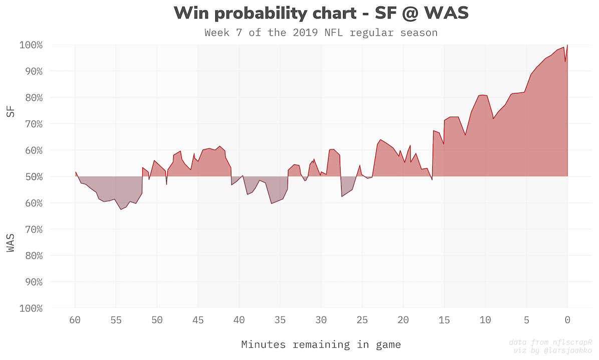
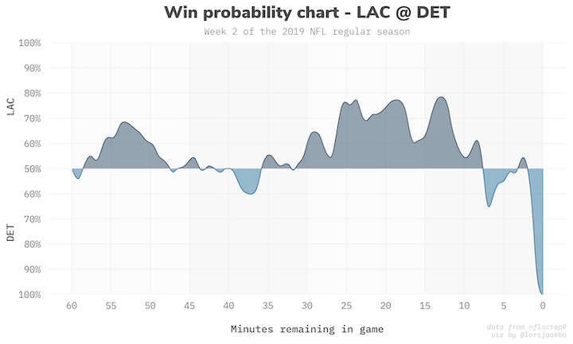
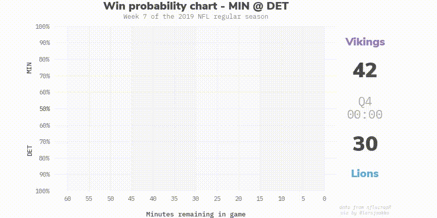

# nfl-wp-charts
A Jupyter Notebook to produce static and animated win probability charts from nflscrapR data.

## Examples:

**Static chart without smoothing**

**Static chart with smoothing**

**Animated chart with smoothing**

*Excuse the potato quality of the gif. The code outputs .mp4 files with better definition.*

## Requirements
The notebook is written using Python 3.7 and relies on (at least) the below packages. I strongly recommend installing Python via [Anaconda](https://www.anaconda.com/distribution/), which will also include these packages out-of-the-box:
- jupyter
- pandas
- numpy
- scipy
- matplotlib
- seaborn

In addition, these packages need to be installed individually:
- [csaps](https://github.com/espdev/csaps) (to smooth the sometimes overly jumpy WP curves)
- [requests](https://requests.kennethreitz.org/en/master/) (to fetch and join week numbers to the nflscrapR data)
- [celluloid](https://github.com/jwkvam/celluloid) (easy matplotlib animation)
- [ffmpeg](https://ffmpeg.org/download.html) (to output animations to video files)

You also need to feed the code with some nflscrapR data, of course.

## Usage notes
The notebook is named [wp-charts.ipynb](https://github.com/larsjaakko/nfl-wp-charts/blob/master/wp-charts.ipynb). Simply open it using Jupyter, tweak the parameters as you like and execute the code!

Note that an animated chart using the suggested 500 frames will take about 5 minutes to render.

## Fonts
The visualizations are optimized to use Nunito Sans for titles and team scores, as well as IBM Plex Mono for labels and ticks. Both fonts have open licences and are included in the `/fonts` folder. If you don't want to use these fonts, please make sure to adjust the font sizes and spacing so it looks decent. If you ignore the recommended fonts and use your system defaults, it'll look shitty. Don't be that guy. Fonts matter.

## Feedback
Feel free to leave an issue in the repo or reach out to me on [Twitter](https://twitter.com/larsjaakko/).
